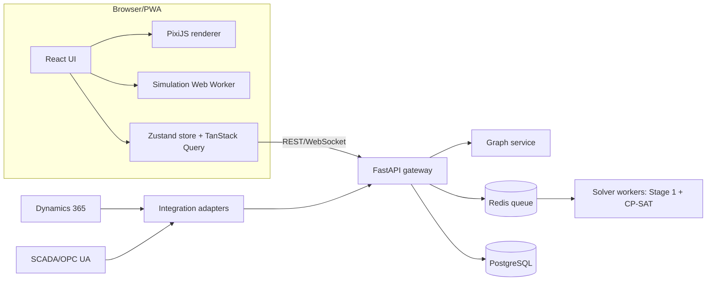

# 05 System Architecture

## Context diagram


## Technology choices
| Layer | Choice | Rationale / alternatives considered |
|---|---|---|
| Frontend language | TypeScript 5, React 18, Vite | Typed, large ecosystem |
| 2D rendering | PixiJS v8 (WebGL/WebGPU) | Handles 10k+ sprites/lines, touch, animation; SVG/React Flow degrade beyond ~1-2k elements |
| 3D (optional) | three.js via react-three-fiber | AnyLogic assets are `.dae`; convert to glTF |
| Backend | Python 3.12, FastAPI, Pydantic v2 | OR-Tools first-class, reference code reusable. .NET is an alternative only if the team is .NET-only; OR-Tools supports it but with less tooling |
| Solver | OR-Tools CP-SAT | Proven on the sample |
| Graph | networkx -> rustworkx | Drop-in migration path |
| Jobs | Redis + ARQ (or Celery) | Long-running solves, progress streaming |
| DB | PostgreSQL 16, JSONB | Versioned design documents |
| Auth | OIDC (Entra ID) | Doc 19 |
| Packaging | Docker, monorepo | Doc 20 |

## Monorepo layout
```
apps/web            React + Pixi UI, simulation worker
packages/schema     JSON Schema + generated TS and Pydantic types
packages/sim-core   Discrete-event engine (TS, no DOM)
services/api        FastAPI
services/solver     Stage 1 + Stage 2, CLI and worker
tests/reference     lineup_cpsat.py oracle + sample terminal JSON
```

## Key flows
1. **Design -> save:** UI posts a TerminalDocument; API validates (schema + graph rules) and stores a new version.
2. **Quickest route:** UI sends (source, destination, product, volume, rate, time); API runs Stage 1 only; returns ranked routes with explanations.
3. **Optimize:** UI submits job set; worker runs Stage 1 per job then Stage 2; progress via WebSocket; result stored.
4. **Availability update:** adapter or user posts AvailabilityEvents; graph snapshot is re-derived; open plans flagged stale.
5. **Simulate:** simulation worker consumes the same TerminalDocument plus a scenario.

## Cross-cutting
Deterministic seeds, versioned documents, structured logging, OpenTelemetry traces.
