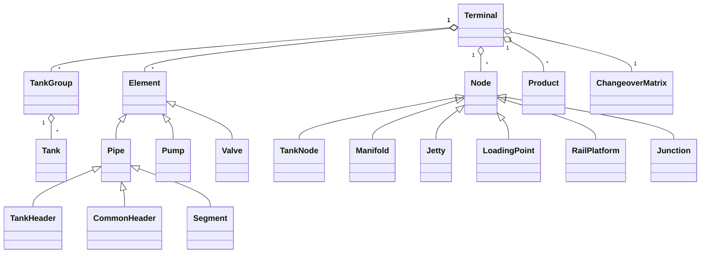

# 06 Domain Model

## Units
Time min, length m, diameter mm, volume m3, flow m3/h, head m, pressure bar, density kg/m3. Stored as SI-like numbers; the UI converts.

## Entities

## Nodes (vertices)
| Type | Notes |
|---|---|
| Tank | product, stock, capacity, min heel, availability, group, inbound/outbound capability, simultaneous in/out flag |
| Jetty / berth | product certification, max rate, vessel limits, tug need |
| LoadingPoint | truck/rail/ISO loading arm |
| RailPlatform | tracks, car count, side (two-sided) |
| Manifold | connects many pipes, optional valves per leg |
| Junction | plain connection point |

## Elements (edges)
Common fields: `id, from, to, type, length_m, diameter_mm, elevation_delta_m, installation (underground|aboveground), roughness_mm, certified_products[], dedicated_group?, dedicated_products[], current_residue, availability, bidirectional`.

| Type | Meaning | Extra fields |
|---|---|---|
| TANK_HEADER (TH) | One-way pipe connected to a single tank | tank_id |
| SEGMENT (SEG) | Pipe connected to a tank; may be shared between groups | tank_id |
| COMMON_HEADER | Shared between multiple tanks or joining two pipelines | - |
| PUMP | Adds head | curve points, one-way flag, min/max flow, efficiency |
| VALVE | Zero length, operation time | open/close time, state, fail-safe |
| JETTY_LINE / LOAD_LINE | Line to jetty or loading point | - |

## Rules from the brief
- Underground vs aboveground multiplies velocity by `installation_velocity_factor` (default underground 0.9, aboveground 1.0; configurable).
- A pipe may carry several products in sequence; each switch incurs a flush (volume, time) and changeover gap from the matrix.
- Pipes may be dedicated to a tank group or product group.
- Tanks support inbound and outbound; simultaneous and sequential modes are tank attributes.
- Equipment availability is a time-bounded status: `AVAILABLE | MAINTENANCE | FLUSHING | CLEANING | OUT_OF_SERVICE`, with `from`, `to`, `reason`, `source`.

## Product
`id, name, group (light|black|...), density, viscosity, friction_factor, max_velocity, color`.

## ChangeoverMatrix
`(from_product, to_product) -> {gap_min, flush_factor, manual_clean_required}`. Reference sample: 1<->2 gap 45, flush factor 1.5.

## Job (work order)
`id, direction (IN|OUT), product, volume, rate, eta, etc, source_candidates[], destination_candidates[], contract_id, priority, lateness_weight`.

## Route
Ordered `[element_id, direction]` plus derived metrics: fill_min, flush_volume, flush_min, valves, common_headers, pump_head_margin, velocity_max.
